# Divvy Station Bluesky Bot

A scheduled TypeScript worker that watches Chicago's public Divvy station
inventory and announces new or newly electrified stations on
[@divvystationbot.bsky.social](https://bsky.app/profile/divvystationbot.bsky.social).
Each announcement starts with a custom 4:5 map card. When Street View is
enabled, the bot publishes a nearby Google Street View image as the first reply.

Publishing is off by default. A first run safely records the current network as
a silent baseline; it does not announce every existing station.

## What the bot announces

The bot fetches the complete station snapshot from the City of Chicago and
compares it with its local SQLite state. It creates an announcement when:

- a station ID appears for the first time after the baseline; or
- an existing station changes from conventional to electrified.

An asterisk at the end of a Divvy station name, or `charging` in its short name,
marks an electrified station. The asterisk is omitted from public post text.
Routine changes such as dock count, name, coordinates, or service status update
the stored snapshot without creating a post.

The announcement cards alternate between two visual styles. The first is
`civic`, the next is `nightline`, and so on. The selected style is stored with
the delivery, which means a retry always reproduces the original card.

### Example post: civic

```text
🆕 New Divvy Station Alert!

📍 State St & Lake St
🚲 23 docks
```

The civic card uses Chicago blue and red accents, left-aligned station details,
and the status `OPEN`.

### Example post: nightline

```text
⚡ Divvy Station Electrified!

📍 Eberhart Ave & 91st St
🚲 15 docks
🔌 This station now has charging docks.
```

The nightline card uses a centered, poster-like treatment and the status
`CHARGED` for electrification announcements (`DEPLOYED` for new stations).
The visual style does not change the accompanying Bluesky text.

## Architecture

```mermaid
flowchart LR
    Trigger["systemd timer or CLI"] --> Worker["One-shot worker"]
    Worker --> Source["Chicago Socrata API"]
    Source --> Validate["Validate complete snapshot"]
    Validate --> Reconcile["Reconcile station state"]
    Reconcile <--> SQLite[("SQLite")]
    Reconcile --> Queue["Create durable events and deliveries"]
    Queue --> SQLite
    SQLite --> Ready["Claim ready deliveries"]
    Ready --> Map["MapLibre card renderer"]
    Map --> Tiles["Protomaps style and tiles"]
    Map --> Publisher["AT Protocol publisher"]
    Publisher --> Bluesky["Bluesky"]
    Publisher -. optional request .-> StreetView["Google Street View"]
    StreetView -. first reply .-> Bluesky
    Publisher --> SQLite
```



Station reconciliation and delivery are separate durable steps. Once an event
has been recorded, a temporary map, Street View, network, or Bluesky failure
cannot silently lose it. Failed deliveries return to the queue with exponential
backoff. AT Protocol record keys are generated once and reused, so the bot can
reconcile a post that reached Bluesky before the local success record was
written.

## Requirements

- Node.js 24
- npm
- Chrome or Chromium
- a Protomaps API key, or another compatible MapLibre style URL, for rendering
- a Bluesky account and app password only when publishing
- a Google Maps API key only when optional Street View images are enabled

The renderer drives Chrome through the bundled `agent-browser` CLI. The
production container supplies Chromium and software WebGL; local development
can use an existing compatible browser or install one through `agent-browser`.

## Quick start

```bash
git clone <repository-url>
cd divvy-bluesky-bot
npm install
npx agent-browser install
cp .env.example .env
npm run dev -- run
```

With the example configuration, the command fetches and validates the station
feed, initializes `data/divvy-bot.sqlite3`, and exits without publishing. Check
the result with:

```bash
npm run dev -- status
```

Keep `PUBLISH_ENABLED=false` while configuring and testing. To publish:

1. Create a Bluesky app password; do not use the account's primary password.
2. Set `BLUESKY_IDENTIFIER` and `BLUESKY_APP_PASSWORD` in `.env`.
3. Set `PROTOMAPS_KEY`, or set `PROTOMAPS_STYLE_URL` to a compatible style.
4. Run a local render and inspect the output.
5. Confirm the pending-delivery count is expected.
6. Set `PUBLISH_ENABLED=true` and run the worker again.

The first valid snapshot in a new database is always silent, whether publishing
is enabled or not.

## Commands

Run one fetch, reconciliation, and delivery cycle:

```bash
npm run dev -- run
```

Show the station count, delivery counts, database path, and publishing state:

```bash
npm run dev -- status
```

Render the default civic card for a station already in the database:

```bash
npm run dev -- render STATION_ID output/example.jpg
```

The output path is optional. If omitted, the JPEG is written beneath
`OUTPUT_DIR`. Rendering needs `PROTOMAPS_KEY` or `PROTOMAPS_STYLE_URL`.

Import a baseline from the legacy Python bot's SQLite database:

```bash
DB_PATH=data/divvy-bot.sqlite3 \
  npm run dev -- import-legacy /path/to/legacy-divvy-stations.db
```

The target database must be empty. Importing creates station state only; it
does not queue announcements.

Production commands use the compiled JavaScript:

```bash
npm run build
npm start
```

## Configuration

Values are read from the environment; `dotenv` loads a local `.env` file.
The complete copyable template is in [`.env.example`](.env.example).

| Variable | Default | Purpose |
| --- | --- | --- |
| `PUBLISH_ENABLED` | `false` | Enables delivery to Bluesky. |
| `POST_LIMIT` | `10` | Maximum ready deliveries attempted in one run. |
| `BLUESKY_SERVICE_URL` | `https://bsky.social` | AT Protocol service URL. |
| `BLUESKY_IDENTIFIER` | unset | Bluesky handle or DID; required to publish. |
| `BLUESKY_APP_PASSWORD` | unset | Bluesky app password; required to publish. |
| `DB_PATH` | `data/divvy-bot.sqlite3` | SQLite state database. Relative paths use the current working directory. |
| `SODA_URL` | Chicago station endpoint | Socrata JSON source URL. |
| `SODA_TIMEOUT_MS` | `30000` | Timeout for each source request. |
| `SODA_MAX_RETRIES` | `3` | Source retries after the initial attempt. |
| `SODA_MIN_STATIONS` | `500` | Rejects suspiciously small snapshots before reconciliation. |
| `PROTOMAPS_KEY` | unset | API key used to build the default hosted light-style URL. |
| `PROTOMAPS_STYLE_URL` | unset | Full MapLibre style URL; overrides the default Protomaps URL. |
| `MAP_WIDTH` | `1080` | Card viewport width. |
| `MAP_HEIGHT` | `1350` | Card viewport height. |
| `MAP_PIXEL_RATIO` | `1` | Browser device scale factor. Keep `1` for a 1080 × 1350 result. |
| `MAP_ZOOM` | `17` | Civic card zoom. |
| `MAP_NIGHTLINE_ZOOM` | `17.5` | Nightline card zoom. |
| `AGENT_BROWSER_EXECUTABLE_PATH` | auto-detected | Explicit Chrome or Chromium executable. |
| `OUTPUT_DIR` | `output` | Default directory for manual renders. |
| `STREETVIEW_ENABLED` | `false` | Publishes Street View as the first reply when available. |
| `GOOGLE_MAPS_API_KEY` | unset | Required only when Street View is enabled. |
| `STREETVIEW_TIMEOUT_MS` | `10000` | Street View request timeout. |
| `NODE_ENV` | `development` | Runtime environment: `development`, `test`, or `production`. |

Boolean values accept `true`, `false`, `1`, or `0`. Startup validation stops
the process if publishing or Street View is enabled without its required
credentials. Browser errors redact `key=` query values from logs.

## Data and delivery behavior

SQLite stores:

- the latest station snapshot and first/last-seen timestamps;
- deduplicated station events;
- queued, processing, retrying, and delivered delivery records;
- the stable Bluesky record key and announcement style for each delivery; and
- run history and failure summaries.

The database uses WAL mode. Back up the database with a SQLite-aware method, or
stop the worker before copying the database together with any `-wal` and `-shm`
files. A delivery left in `processing` for more than 30 minutes is recovered on
the next run. Retry delays double from one minute up to a maximum of 12 hours.

Event deduplication is by event type and station ID. A station is announced at
most once as discovered and at most once as electrified.

## Images

Map cards are rendered at 1080 × 1350 by default. The encoder searches for the
highest JPEG quality that fits the current
[`app.bsky.embed.images`](https://github.com/bluesky-social/atproto/blob/main/lexicons/app/bsky/embed/images.json)
limit of 2,000,000 bytes per image. The embedded map uses a hosted Protomaps
light style unless `PROTOMAPS_STYLE_URL` is supplied. Both card styles add a
bright red station marker and readable map attribution. The balanced map
treatment strengthens the street hierarchy, retains Protomaps' OpenStreetMap
points of interest, and overlays official City of Chicago CTA bus routes, rail
lines, and rail stations.

When Street View is enabled, an unavailable or failed Street View request is
non-fatal: the bot logs a warning and publishes the map card alone. When it is
available, Street View is published as a single-image reply. Both images'
alt text describes the complete station snapshot and links to its matching City
of Chicago API record.

## Docker

Build the same `linux/amd64` image used on the current host:

```bash
docker buildx build \
  --platform linux/amd64 \
  --load \
  -t divvy-bluesky-bot:2.0.0 \
  .
```

Run it with persistent state:

```bash
docker run --rm \
  --env-file .env \
  --volume "$PWD/data:/var/lib/divvy-bot" \
  divvy-bluesky-bot:2.0.0
```

For that mount, set `DB_PATH=/var/lib/divvy-bot/bot.sqlite3`. The runtime image
runs as UID `1000`, so the mounted directory must be writable by that user.

## systemd deployment

The files in [`deploy/`](deploy/) define a one-shot Docker service and a timer
that runs at 00:00, 06:00, 12:00, and 18:00 UTC.

On the host:

1. Create `/var/lib/divvy-bot` and make it writable by UID `1000`.
2. Put production configuration in `/etc/divvy-bot.env`, including
   `DB_PATH=/var/lib/divvy-bot/bot.sqlite3`.
3. Install `deploy/divvy-bot.service` and `deploy/divvy-bot.timer` in
   `/etc/systemd/system`.
4. Optionally put an immutable image reference in `/etc/divvy-bot-image.env` as
   `DIVVY_BOT_IMAGE=registry/image@sha256:...`.
5. Reload systemd and enable the timer.

```bash
sudo systemctl daemon-reload
sudo systemctl enable --now divvy-bot.timer
sudo systemctl start divvy-bot.service
sudo journalctl -u divvy-bot.service
```

For a migration, leave publishing disabled during shadow runs and use a
disposable database. Disable the legacy PM2 or cron schedule before the final
import and cutover; two publishers must not run against separate state
databases.

## Development

```bash
npm run typecheck
npm test
npm run build
```

Tests cover configuration safety, source validation, silent initialization,
event idempotency, electrification, alternating styles, retry state, legacy
import, browser orchestration, secret redaction, threaded image publishing,
API-linked alt text, and post content.

The files in `src/*.py`, `config.yaml`, `requirements.txt`, and the tracked 2024
database are retained only for legacy comparison and migration. The TypeScript
worker does not invoke them.

## Troubleshooting

- **No posts appeared:** check `PUBLISH_ENABLED`, then run `status`. A fresh
  database creates a silent baseline and intentionally queues nothing.
- **The source was rejected as too small:** verify the Socrata endpoint and
  network, or lower `SODA_MIN_STATIONS` only for a known test fixture.
- **A render cannot start Chrome:** run `npx agent-browser install`, or set
  `AGENT_BROWSER_EXECUTABLE_PATH` to a compatible local executable.
- **A render reports a style or tile error:** verify `PROTOMAPS_KEY` or the full
  `PROTOMAPS_STYLE_URL`, including any URL-access restrictions.
- **Deliveries remain queued:** inspect the service logs and `status`. Failed
  attempts are retried later and are not discarded.
